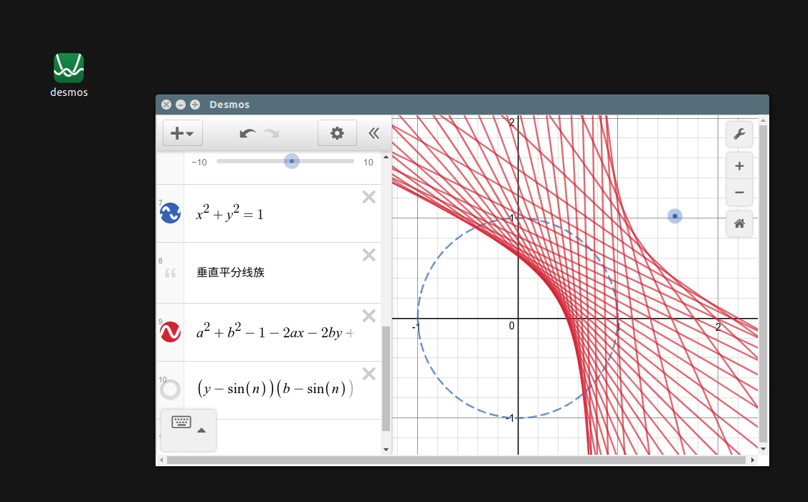

# Desmos Desktop

[Desmos](https://www.desmos.com/about) is an advanced graphing calculator implemented as a web application and a mobile application written in JavaScript. Here is a very simple cross-platform desktop version. **Plotting, saving, opening and exporting offlinely** are supportive. Examples are in 'examples' folder.

[Desmos](https://www.desmos.com/about) 是一款优秀的、免费的在线数学函数计算器。它基于JavaScript，有在线版和手机版。这里是一个基于[Electron](http://electron.atom.io/)的**简单的离线桌面版**，可以离线绘制和保存以及输出截图。支持linux, Mac 和 Win平台(目前还没有在Mac上尝试，留下贫穷的眼泪...)。



## Install

The executable binary files have been released  [here](https://github.com/DingShizhe/Desmos-Desktop/releases/tag/v1.0.0). There are only win and linux(ubuntu) versions. If you want Mac(or other platforms) version, try to build it.

After installation, try to use it to open the `des` files in 'examples'.

## Build
```
git clone https://github.com/DingShizhe/Desmos-Desktop.git
cd Desmos-Desktop
npm install -d
npm run dist
cd dist && ls   # WOW! Then move the package wherever you want. 
```
On linux, you need edit ./res/appimagekit-desmos.desktop properly and move it to ./local/share/applications.

## Dependency
- [Node.js](https://nodejs.org/en/)
- [Electron](http://electron.atom.io/)
- [Desmos API](https://www.desmos.com/api/)


## Simple Functions (features) Now
Now you can use this simple app to
- Draw mathematical curves just like the web version
- Export screenshot as `.png` file
- Save or reload graph state as `.des` file (just json)
- Fade out message effect.
- Note when new a file or close file but current file hasnot been saved
- Open the last opened file when launch
- Use 'examples/getDesByUrl.py' to get `.des` file from desmos website
  .

## My Artworks (except the last one)

Try open `.des` files in 'examples'.

  

  

  

Hope this helpful. Enjoy ;)
